# ALU Talent Connect — Technical Report

**A Flutter/Firebase Internship Marketplace Connecting ALU Students to Student-Led Startups**

Author: Paul Masamvu — ALU Student ID: PAUL202425
Course/Assignment: Formative Assignment 2
Date: July 13, 2026
Citation style: IEEE

---

## Abstract

ALU Talent Connect is a cross-platform Flutter application that connects African Leadership University (ALU) students seeking internships and project work with ALU student-led startups posting opportunities. The application is built on a feature-first, layered (data/domain/presentation) architecture, uses Riverpod for reactive state management, Firebase Authentication for identity, and Cloud Firestore as a real-time NoSQL backend [1], [2]. This report documents the system architecture, the Firebase backend and schema design, the state-management approach, the primary application workflows, the UI/UX design rationale, scalability considerations, challenges encountered during development and how they were resolved, the testing strategy, known limitations, and planned future improvements, closing with lessons learned from building the system.

---

## Table of Contents

1. [Introduction](#1-introduction)
2. [System Architecture](#2-system-architecture)
3. [Firebase Backend Structure](#3-firebase-backend-structure)
4. [State Management Approach](#4-state-management-approach)
5. [Application Workflows](#5-application-workflows)
6. [UI/UX Reasoning](#6-uiux-reasoning)
7. [Scalability Considerations](#7-scalability-considerations)
8. [Challenges Encountered and How They Were Overcome](#8-challenges-encountered-and-how-they-were-overcome)
9. [Testing Strategy](#9-testing-strategy)
10. [Limitations](#10-limitations)
11. [Future Improvements](#11-future-improvements)
12. [Lessons Learned](#12-lessons-learned)
13. [Conclusion](#13-conclusion)
14. [References](#14-references)
15. [Appendix A — Screenshots](#appendix-a--screenshots)

---

## 1. Introduction

### 1.1 Problem Statement

ALU student-led startups need a lightweight way to advertise internships and project roles to their own student body, and ALU students need a single place to discover and apply to those roles without relying on informal WhatsApp groups or spreadsheets. ALU Talent Connect addresses this with a mobile-first application with two user roles — **Student** and **Startup Founder** — sharing a single codebase and a single Firebase project.

### 1.2 Scope

The current build targets Android (the only platform with a registered Firebase configuration — see §10.5) and implements: authentication, role-based onboarding, startup and opportunity creation, a skill-matched opportunity feed, and a full apply → review → decide application lifecycle.

### 1.3 Technology Stack

| Layer | Technology | Version |
|---|---|---|
| Client framework | Flutter | SDK `^3.11.5` |
| State management | flutter_riverpod (Notifier API) | `^3.3.2` |
| Routing | go_router | `^17.3.0` |
| Backend / Auth | firebase_auth | `^6.5.4` |
| Backend / Database | cloud_firestore | `^6.6.0` |
| Typography | google_fonts (Inter) | `^8.1.0` |
| Value equality | equatable | `^2.1.0` |

The stack choice follows current Flutter/Firebase ecosystem guidance for small-to-medium mobile products that need real-time data without standing up a custom backend [1], [3].

---

## 2. System Architecture

### 2.1 Architectural Style

The codebase combines two organizational strategies deliberately:

- **Feature-first** at the top level (`auth`, `profiles`, `opportunities`, `applications`) — each feature is a vertical slice that can be reasoned about, tested, and modified independently.
- **Clean Architecture layering** *within* each feature (`data` / `domain` / `presentation`) — a pattern popularized by Martin [4] and widely adopted in production Flutter codebases specifically because Firestore's lack of a schema-enforcing server layer makes it easy for UI code to "leak" persistence concerns if there is no explicit boundary.

```
lib/
├── main.dart                 # Entry point — Firebase.initializeApp() + ProviderScope
├── app.dart                  # MaterialApp.router root widget
├── firebase_options.dart     # FlutterFire-generated platform config
│
├── core/                     # Cross-cutting, feature-agnostic code
│   ├── constants/            # Firestore collection name constants
│   ├── database/             # Field-name constants + schema documentation
│   ├── errors/                # Exception + sealed Failure hierarchy
│   ├── providers/             # Raw FirebaseAuth / FirebaseFirestore singletons
│   ├── router/                # GoRouter config + auth-driven refresh notifier
│   ├── shell/                 # Bottom-navigation shell (MainShell)
│   ├── theme/                 # Colors, ThemeData, spacing, decorations
│   ├── utils/                  # Validators, auth error mapper, typedefs
│   └── widgets/                # Reusable UI primitives
│
└── features/
    ├── auth/          {data, domain, presentation}
    ├── profiles/       {data, domain, presentation}   # users + startups
    ├── opportunities/  {data, domain, presentation}
    └── applications/   {data, domain, presentation}
```

### 2.2 High-Level Architecture Diagram

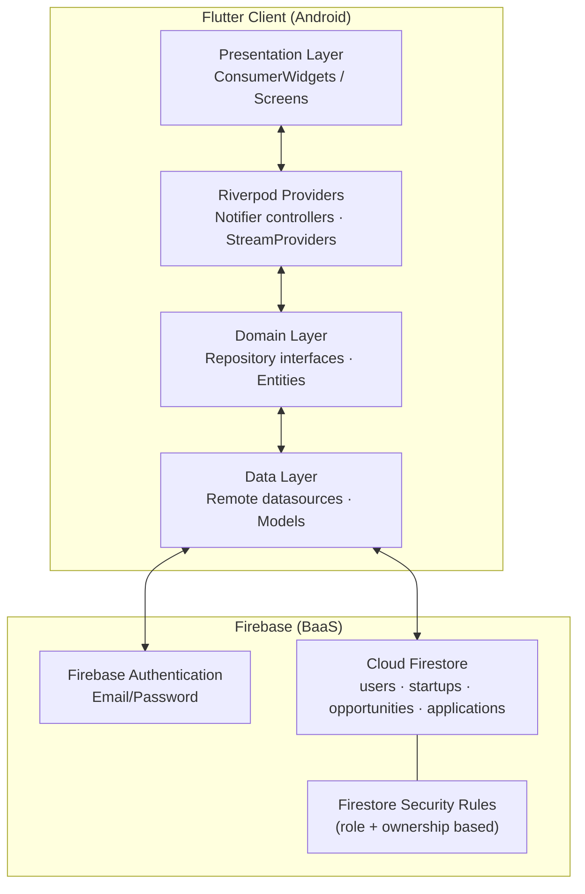

Each arrow is a one-directional dependency: the presentation layer never imports Firebase SDK types directly, the domain layer never imports `cloud_firestore` or `firebase_auth`, and only the data layer touches the Firebase SDK — consistent with the Dependency Inversion Principle [4].

### 2.3 Per-Feature Layered Architecture

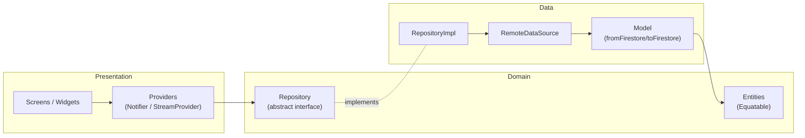

This is the standard Repository pattern: `Provider` code depends only on the abstract `Repository` interface declared in `domain/`, never on `RepositoryImpl` directly. Riverpod's `Provider<Repository>` performs the wiring, so a repository could be swapped for a fake/mock in tests without touching UI code — though, as discussed in §9, this seam is not currently exercised by any test.

### 2.4 Entry Point and Bootstrapping

`main.dart` calls `Firebase.initializeApp()` before `runApp`, and wraps the app in a Riverpod `ProviderScope` so every provider in the tree has a single, app-lifetime container. `app.dart` builds a single `MaterialApp.router`, reading the `routerProvider` once — routing state (see §5.1) is therefore the single source of truth for what the user sees, rather than an imperative `Navigator.push` stack.

---

## 3. Firebase Backend Structure

### 3.1 Firebase Authentication

Only **email/password** authentication is used [5]. All Auth calls are centralized in a single `AuthRemoteDataSource` so the rest of the app never calls `FirebaseAuth.instance` directly — the two Firebase SDK singletons (`FirebaseAuth`, `FirebaseFirestore`) are themselves exposed through `Provider`s, which is what allows the seam described in §2.3.

Design details worth noting:

- **Sign-out ordering.** `signOut()` subscribes to `authStateChanges().firstWhere((u) => u == null)` *before* calling `FirebaseAuth.instance.signOut()`, then awaits that future. This closes a race where the `Future` returned by `signOut()` could resolve before stream listeners (including the router's redirect logic) observe the change, which would otherwise let a frame render with a signed-out user on an authenticated route.
- **Role storage.** There are no Firebase Auth custom claims. The student/startup-founder role lives entirely in Firestore, at `users/{uid}.role`. This is a simpler mental model for a small team to reason about than server-side custom-claim minting (which requires a Cloud Function), at the cost of an extra `get()` read inside every security rule that needs to know the caller's role (§3.4).
- **Error normalization.** `AuthErrorMapper` maps `FirebaseAuthException` codes (`invalid-email`, `user-not-found`, `wrong-password`, `email-already-in-use`, `weak-password`, `too-many-requests`, `network-request-failed`, `invalid-credential`) to user-facing copy, so screens never show a raw Firebase error string.

### 3.2 Cloud Firestore — Collections and Schema

The schema follows an explicit, documented set of design principles (`lib/core/database/firestore_schema.dart`): denormalization to avoid Firestore's lack of joins, flat top-level collections (no subcollections) for simpler cross-entity querying, deterministic document IDs where uniqueness must be enforced, counters for cheap aggregate reads, and soft deletes to preserve history [2], [6].

#### 3.2.1 Entity-Relationship Diagram

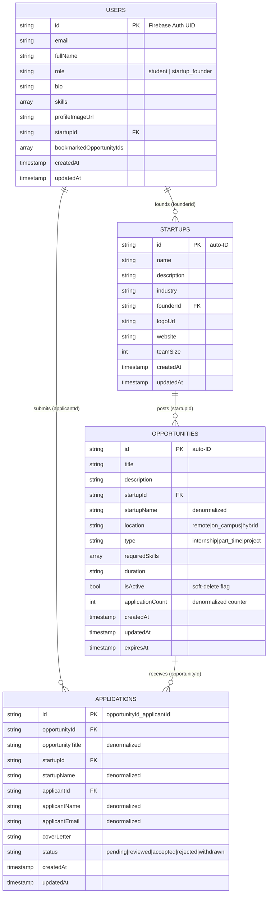

#### 3.2.2 Collection Reference

| Collection | Document ID | Written by | Purpose |
|---|---|---|---|
| `users/{uid}` | Firebase Auth UID | Sign-up flow | Profile + role source of truth |
| `startups/{id}` | Auto-generated | `StartupController.createStartup()` | One document per founder's company |
| `opportunities/{id}` | Auto-generated | `OpportunityController.createOpportunity()` | Postings, soft-deleted via `isActive` |
| `applications/{oppId}_{uid}` | **Deterministic composite** | `ApplicationRemoteDataSource.submitApplication()` | One application per student per opportunity |

The deterministic application ID (`{opportunityId}_{applicantId}`) is the schema's single most load-bearing design decision: it turns "has this student already applied?" from a query into an O(1) document-existence check, and it makes duplicate applications structurally impossible without any additional locking.

#### 3.2.3 Transactional Write — Apply to an Opportunity

The one genuinely atomic write in the system is `submitApplication`, implemented as a Firestore transaction so that the uniqueness check, the opportunity's active-status check, and the counter increment are all-or-nothing [2]:

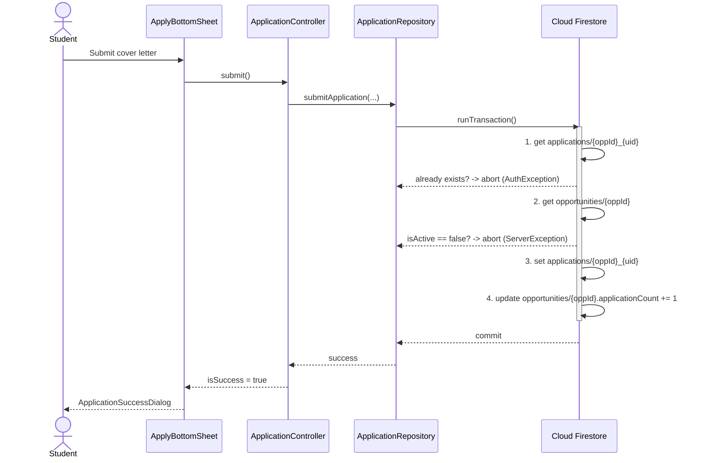

### 3.3 Composite Indexes

`firestore.indexes.json` declares seven composite indexes, three of which back queries actually issued today (feed by `isActive`+`createdAt`, founder's own postings by `startupId`+`createdAt`, and applications lists by `applicantId`/`startupId`+`createdAt`). The remaining four (`isActive`+`applicationCount`, `opportunityId`+`createdAt`, `applicantId`+`status`+`createdAt`) are provisioned ahead of features that are scaffolded in the data model but not yet wired to UI — see §10.

### 3.4 Security Rules

Because role is stored in Firestore rather than in an Auth custom claim, every rule that needs to know "is this caller a student or a founder" performs a `get()` on the caller's own `users/{uid}` document (`firestore.rules`, `userDoc()` helper). This is the direct rules-layer cost of the §3.1 design choice: each authorization check server-side costs one extra document read against Firestore's free quota, versus a custom claim being available for free inside the JWT [7]. For an application at this scale that trade-off favors simplicity.

Key invariants enforced at the rules layer (not just in application code):

- Every collection has `allow delete: if false` — the soft-delete pattern is enforced server-side, not just by convention.
- `applications` creation requires `status == 'pending'` *and* the document ID to equal `{opportunityId}_{uid}`, so a malicious client cannot forge an application under another student's identity or bypass the one-application-per-opportunity invariant even if it skipped the client-side transaction logic entirely.
- `applications` updates are restricted by role: a student may only transition their own application to `withdrawn`; a founder may only transition applications on opportunities they own to `reviewed`/`accepted`/`rejected`. Neither party can set an arbitrary status.

This defense-in-depth is important precisely because Firestore security rules — not the Flutter client — are the actual trust boundary: any user can bypass the app's Dart code entirely and write to Firestore's REST/gRPC API directly, so business rules that only exist in `ApplicationRemoteDataSource` would be unenforced without the mirrored rule [7].

### 3.5 Firebase Project Configuration

The Android client is registered under Firebase project `alu-talent-connect-app-be129` (`android/app/google-services.json`), package name `com.alu.alu_talent_connect`. No OAuth client is configured, consistent with email/password-only authentication. No iOS `GoogleService-Info.plist` exists yet — iOS is not currently a build target despite the `ios/` platform folder being present (see §10.5).

---

## 4. State Management Approach

### 4.1 Why Riverpod

Riverpod was chosen over `Provider`/`ChangeNotifier`, BLoC, or GetX for three reasons that matter specifically for a Firebase-backed app: (1) native, ergonomic support for `Stream<T>` → `AsyncValue<T>` conversion, which maps directly onto Firestore's real-time snapshot listeners; (2) compile-time provider safety (no `BuildContext`-based lookup failures); and (3) automatic disposal of stream subscriptions when a provider's dependents unmount, which matters because every screen in this app is backed by a live Firestore listener and leaking those would leak both memory and Firestore read quota [8].

### 4.2 Layering Pattern

Every feature follows the same provider chain:

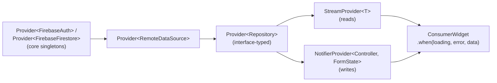

**Read side** — `StreamProvider`s wrap Firestore snapshot listeners directly, so the UI updates in real time whenever the underlying document/query changes, with zero manual refresh logic: `activeOpportunitiesProvider`, `opportunityDetailProvider` (family, keyed by ID), `currentUserProfileProvider`, `currentUserStartupProvider`, `studentApplicationsProvider`, `startupApplicationsProvider`, `opportunityApplicationProvider` (family — "have I applied to X").

**Write side** — Every form-driven mutation goes through a `Notifier<FormState>` controller (Riverpod 3's `Notifier` API, not the deprecated `StateNotifier`), where `FormState` is a small `Equatable` value object with `isLoading` / `errorMessage` / `isSuccess` fields and a `copyWith` that supports explicit "clear" flags — necessary because a naive `copyWith(errorMessage: null)` is indistinguishable from "don't change this field" in Dart's default null-coalescing pattern.

### 4.3 Router–State Integration

`go_router`'s `redirect` callback is synchronous and re-evaluated on every navigation, but Firebase's auth state resolves asynchronously. `RouterRefreshNotifier` bridges the two: it's a `ChangeNotifier` that listens to `authStateChangesProvider` (itself a `StreamProvider` wrapping `FirebaseAuth.authStateChanges()`) and calls `notifyListeners()` on every emission. `GoRouter(refreshListenable: refreshNotifier)` then re-runs the redirect logic automatically whenever auth state changes — not only when the user taps something — which is what makes "sign out from any screen" correctly bounce the user to `/login` without an explicit `context.go()` call at every sign-out call site.

### 4.4 Error Propagation Through State

Errors flow through four explicit layers before reaching the screen (Firebase SDK exception → app-specific `Exception` → sealed `Failure` → `FormState.errorMessage`), each layer translating toward user intent rather than implementation detail. This is the same pattern for all four features' controllers, which keeps error-handling code predictable to read even though it is not abstracted into a shared base class.

---

## 5. Application Workflows

### 5.1 Authentication and Routing Flow

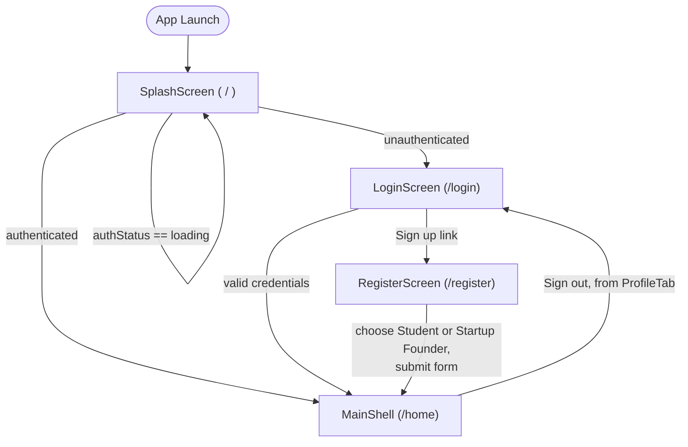

The redirect logic in `app_router.dart` is the single authorization gate for the whole app: while Firebase is restoring a session, every route is forced to splash; once resolved, unauthenticated users are forced onto `/login` and authenticated users are bounced away from `/login`/`/register`/`/`. Screens never need their own "am I logged in" guard.

### 5.2 Student Workflow

1. **Register** as a Student (role picker on `RegisterScreen`).
2. **Explore tab** (`OpportunityFeedScreen`) — real-time feed of active opportunities, client-side re-sorted by `Opportunity.skillMatchScore()` against the student's own `skills` array (a simple case-insensitive overlap count, not a weighted/ML ranking — see §10.1).
3. Tap a card → **OpportunityDetailScreen** — full description, required skills, and a role-conditional bottom bar. If the student has already applied, the bar shows their current `ApplicationStatus` instead of an "Apply" button.
4. **Apply** → `ApplyBottomSheet` (cover letter, optional) → `ApplicationController.submit()` → the transactional write described in §3.2.3 → `ApplicationSuccessDialog`.
5. **Applications tab** (`ApplicationsDashboardScreen`) — "My Applications" with stat chips (total / pending / accepted) and a live list of `ApplicationCard`s, each reflecting real-time status changes made by the founder.
6. **Profile tab** — bio, skills, sign-out.

*See Appendix A, Figures 1–2, for the Explore feed and opportunity detail screen captured from the running application.*

### 5.3 Startup-Founder Workflow

1. **Register** as a Startup Founder.
2. **Profile tab** shows a "Create startup" prompt until a startup exists; **CreateStartupScreen** collects name/industry/description/team size/website, and `StartupController.createStartup()` both creates the `startups` document and links it back onto the founder's own `users/{uid}.startupId` field in the same controller call (not a Firestore transaction — see §10.2).
3. Once a startup exists, the Profile tab exposes **"My opportunities"** and **"Post role"**.
4. **CreateOpportunityScreen** — title, description, type (Internship / Part-time / Project), location (Remote / On Campus / Hybrid), duration, comma-separated required skills → `OpportunityController.createOpportunity()`.
5. **MyOpportunitiesScreen** — every opportunity the founder has posted, with a `Switch` per item that toggles `isActive` (soft delete / republish) via `OpportunityController.setActive()`.
6. **Applications tab** — for a founder this renders "Applications Received" instead of "My Applications": a list of `FounderApplicationCard`s per opportunity with inline **Accept** / **Reject** actions, each calling `ApplicationReviewController`, which tracks per-application-ID loading state so only the button that was tapped shows a spinner while its Firestore write is in flight.

*See Appendix A, Figures 3–5, for the founder Profile tab, My Opportunities screen, and Post-an-opportunity form captured from the running application.*

### 5.4 Cross-Cutting: Real-Time Propagation

Because every list/detail screen is backed by a `StreamProvider`, a founder accepting an application is visible on the student's Applications tab without any refresh action — Firestore pushes the updated document, Riverpod's `StreamProvider` re-emits, and `AsyncValue.data` rebuilds only the affected `ConsumerWidget` subtree.

---

## 6. UI/UX Reasoning

### 6.1 Design System

Theming is centralized in `lib/core/theme/` rather than scattered as inline `Color`/`TextStyle` literals: `AppColors` defines an ALU-branded navy/gold palette (`primary` #1B365D, `accent` #E8A317) plus semantic tokens (`success`, `error`, `warning`, `border`), and a single `AppTheme.light` `ThemeData` (Material 3 [9]) applies per-component overrides (`AppBarTheme`, `CardThemeData`, button themes, `InputDecorationTheme`, `NavigationBarThemeData`, etc.) so every screen inherits consistent spacing, radii, and typography (Google Fonts' Inter [10]) without repeating styling code. `AppSpacing` centralizes a spacing scale (`xs`=4 … `xxxl`=48) specifically to eliminate "magic number" padding values, a common source of visual inconsistency as a Flutter codebase grows.

### 6.2 Reusable Component Library

`lib/core/widgets/` provides the primitives every screen composes from: `AppTextField` (consistent icon/validator plumbing), `PrimaryButton` (loading-aware — disables and shows a spinner during async submission automatically), `ErrorBanner`/`ErrorState`/`EmptyState` (three distinct failure/absence states, deliberately not conflated — a form validation error, a failed stream, and "no results yet" read differently to a user and are styled differently), `ShimmerBox`-based skeleton loaders per screen (`OpportunityFeedSkeleton`, `ApplicationsDashboardSkeleton`, `ProfileSkeleton`), and `BrandedHeader`/`SectionHeader` for consistent section framing.

### 6.3 Loading and Error State Convention

Every `AsyncValue` consumer uses the same `.when(loading:, error:, data:)` triad — skeleton, `ErrorState` with a retry action (`ref.invalidate(provider)`), or real content — so a user learns the app's loading/error "language" once and it holds everywhere. Form-submission loading is deliberately decoupled from this: it is tracked in the per-feature `FormState.isLoading`, distinct from read-side `AsyncValue` loading, because a form can be mid-submission while its surrounding screen's read data is already loaded — conflating the two would produce misleading spinners.

### 6.4 Form Validation

All forms share one `Validators` utility (`email`, `password` — 6-character minimum matching Firebase Auth's own server-side minimum, `requiredField`, `confirmPassword`) and the standard `GlobalKey<FormState>` + `TextFormField.validator` idiom, so validation behavior (when errors appear, what they say) is uniform across `LoginScreen`, `RegisterScreen`, `CreateStartupScreen`, and `CreateOpportunityScreen`.

### 6.5 Role-Conditional UI, Not Role-Conditional Screens

Rather than building separate screen trees for students and founders, `ApplicationsDashboardScreen` and `OpportunityDetailScreen`'s bottom bar branch *internally* on `currentUserProfileProvider`'s role. This was a deliberate choice to avoid duplicating the (fairly complex) real-time list/loading/error scaffolding for what is, visually, the same screen shape with different content and actions — at the cost of slightly more conditional logic inside two widgets, which is judged the better trade-off for a two-role app of this size.

---

## 7. Scalability Considerations

### 7.1 Data-Layer Scalability

- **Denormalization over joins** — Firestore has no server-side joins [2], so `startupName`, `opportunityTitle`, `applicantName`, and `applicantEmail` are copied onto the documents that reference them. This trades a small amount of write-time duplication (and the possibility of stale denormalized copies if a startup renames itself — see §10.3) for feed and list reads that scale as O(1) round trips regardless of collection size, instead of O(n) "fan-out" reads per list item.
- **Counters over aggregation** — `opportunities.applicationCount` is maintained via `FieldValue.increment()` inside the same transaction as the application write, so displaying "12 applied" never requires counting the `applications` collection.
- **Deterministic IDs over uniqueness queries** — as discussed in §3.2.2, `{opportunityId}_{applicantId}` turns a would-be `WHERE applicantId == X AND opportunityId == Y` uniqueness query into a single document read, which is both cheaper and race-condition-free without needing a transaction just for the uniqueness check.
- **Composite indexes** are pre-provisioned in `firestore.indexes.json` for every query the app issues, so query latency stays flat as collections grow into the millions of documents, per Firestore's indexed-query guarantees [2].
- **Soft deletes** (`isActive`) instead of hard deletes preserve `applicationCount` history and referential integrity for existing `applications` documents that point at an opportunity — a hard delete would either orphan those documents or require a fan-out delete, which Firestore recommends against doing synchronously from a client [2].

### 7.2 State-Management Scalability

Riverpod's automatic provider disposal means Firestore listeners are only open for screens currently mounted — a user browsing the feed does not keep the founder-inbox listener alive in the background. `StreamProvider.family` (used for `opportunityDetailProvider` and `opportunityApplicationProvider`) caches a distinct provider instance per argument, so navigating between ten opportunity detail pages opens/closes ten independent listeners rather than one listener re-querying ten times.

### 7.3 Known Scalability Gaps

- **No pagination.** `activeOpportunitiesProvider` and both application-list providers fetch the entire matching query result in one `StreamProvider` — acceptable at hundreds of documents, but will need `.limit()` + cursor-based pagination (e.g., `startAfterDocument`) before the opportunities collection reaches the low thousands, to bound both client memory and Firestore read cost per screen view [2].
- **Client-side skill matching.** `recommendedOpportunitiesProvider` re-sorts the *entire* fetched feed in Dart rather than filtering server-side via `array-contains-any` (which Firestore supports for up to 10 values [2]). This is fine at current scale but means the client always downloads every active opportunity even when most don't match the student's skills.
- **Firestore rules `get()` cost.** Every rules evaluation that calls `userDoc()` or `ownsStartup()` performs an additional document read billed against the caller, which is the direct cost of the role-in-Firestore-not-in-claims design (§3.1); at very high write volume this is worth revisiting in favor of custom claims minted by a Cloud Function on role assignment.

---

## 8. Challenges Encountered and How They Were Overcome

### 8.1 Emulator Sign-In Failures from reCAPTCHA/Play Integrity Attestation

**Challenge.** During development, `signInWithPassword` intermittently failed on the Android emulator with `RecaptchaCallWrapper` network errors, even though the same code path worked reliably on physical devices. Recent `firebase_auth` releases run a Play Integrity/reCAPTCHA Enterprise attestation check as an anti-abuse measure on sensitive Auth operations [11], [12], and that attestation call requires the emulator to successfully reach Google's attestation servers — something "Google APIs"-only emulator images (without Play Store) or emulators with transient DNS/network issues cannot reliably do.

**Resolution.** The issue was isolated to the emulator's network/attestation environment rather than application code, by confirming the identical sign-in flow succeeded on a Play Store-enabled emulator image after a cold boot, and that failures correlated with emulator network flakiness (verified by loading a page in the emulator's browser) rather than with any specific credential or code path. No application-code change was required; this is documented here because it is a Firebase/Android-tooling interaction that is easy to misdiagnose as a backend bug.

**Takeaway.** Treat `RecaptchaCallWrapper`/attestation network errors as an environment signal, not an auth-logic bug — verify emulator connectivity and Play Store provisioning before debugging `AuthRemoteDataSource`.

### 8.2 Preventing Duplicate Applications Without Extra Round-Trips

**Challenge.** The naive way to enforce "one application per student per opportunity" is a query-then-write (`WHERE applicantId == uid AND opportunityId == oppId`, then `add()` if empty) — but that pattern is a classic time-of-check-to-time-of-use race under concurrent requests (e.g., a double-tap on "Apply") and costs an extra read on every attempt.

**Resolution.** Adopted a deterministic composite document ID (`{opportunityId}_{applicantId}`) so uniqueness is enforced by Firestore's own document-existence semantics inside a single `runTransaction()` call, and mirrored the same constraint at the security-rules layer (`applicationId == request.resource.data.opportunityId + '_' + request.auth.uid`) so the invariant holds even against a client that bypasses the app's Dart code entirely.

### 8.3 Keeping Riverpod Read/Write State Consistent With Riverpod 3's API Migration

**Challenge.** Riverpod 3 deprecates `StateNotifier`/`StateNotifierProvider` in favor of `Notifier`/`NotifierProvider`, and mixing the two idioms across features would have made the provider layer inconsistent to read and reason about.

**Resolution.** Standardized every write-side controller across all four features (`AuthController`, `StartupController`, `OpportunityController`, `ApplicationController`, `ApplicationReviewController`) on the `Notifier<FormState>` API from the outset, with an identical `Equatable`-based form-state shape and identical `on Failure catch` error-handling pattern, so a developer who understands one feature's controller immediately understands all five.

### 8.4 Router Redirects Racing Asynchronous Auth State

**Challenge.** `go_router`'s `redirect` callback runs synchronously on every navigation attempt, but `FirebaseAuth`'s session restoration on app cold-start is asynchronous — a naive redirect implementation would momentarily redirect a *should-be-authenticated* user to `/login` before Firebase finishes restoring their session.

**Resolution.** Introduced an explicit `AuthStatus.loading` state (distinct from `authenticated`/`unauthenticated`) that pins every route to the splash screen until Firebase's auth stream emits its first value, combined with `RouterRefreshNotifier` (§4.3) so the redirect re-evaluates automatically the moment that first value arrives, rather than requiring a manual navigation call at every listener site.

---

## 9. Testing Strategy

### 9.1 Current Coverage

The repository currently contains a single widget test (`test/widget_test.dart`) that pumps the app with `routerProvider` overridden to a minimal `GoRouter` pointing directly at `LoginScreen`, and asserts that "Welcome back" and "Sign In" render while the app name does not. This confirms two things: the login form renders correctly in isolation, and `routerProvider` is a valid override seam for tests (a Riverpod-specific technique for substituting real dependencies with the goal of testing widgets without a live Firebase connection [8]).

### 9.2 Why Coverage Is Currently Thin, and What It Should Grow Into

The Repository-pattern boundary described in §2.3 exists specifically so business logic can be unit-tested without a live Firestore instance, but no unit tests currently exercise it. A prioritized testing roadmap, ordered by risk × effort:

1. **Security rules tests** (highest leverage, not yet written) — using the Firebase Emulator Suite and `@firebase/rules-unit-testing`, assert directly against `firestore.rules` that: a student cannot write another student's `applications` document, a founder cannot accept an application for an opportunity they don't own, and a client cannot forge `applicationId` to bypass the one-application-per-opportunity invariant. This is the highest-leverage test suite because rules are the actual trust boundary (§3.4), and rule regressions are otherwise invisible to `flutter test`.
2. **Repository unit tests** with a faked `FirebaseFirestore` (`fake_cloud_firestore` package) or the Firestore emulator — particularly the `submitApplication` transaction's three failure branches (already-applied, opportunity inactive, opportunity not found).
3. **Controller/provider unit tests** using `ProviderContainer` overrides to inject fake repositories, asserting `FormState` transitions (`isLoading` → `isSuccess`/`errorMessage`) without touching Firebase at all.
4. **Widget tests** for the role-conditional screens (`OpportunityDetailScreen`'s apply bar, `ApplicationsDashboardScreen`'s student-vs-founder branch) with both roles' provider states overridden.
5. **Integration tests** (`integration_test` package) driving the real emulator-backed Firebase project through the full apply → accept flow end-to-end.

### 9.3 Manual Testing Performed

Manual verification during development covered: registration with both roles, sign-in/sign-out (including the race condition in §8.4), startup creation and linkage, opportunity creation with each `type`/`location` combination, the apply flow's duplicate-prevention behavior, and the founder accept/reject flow's real-time propagation to the student's dashboard — the last of which was confirmed by observing an `ApplicationCard`'s status badge update live without a manual refresh (Appendix A documents screens captured from this manual pass).

---

## 10. Limitations

The following gaps were identified by direct code inspection rather than by symptom — none currently causes a user-visible failure in the happy path, but each represents scaffolded-but-incomplete work or a known trade-off worth flagging explicitly.

1. **Bookmark feature is scaffolded but unwired.** `UserProfile.bookmarkedOpportunityIds` exists in the entity, the Firestore model, and the schema documentation, along with a `hasBookmarked()` helper — but no repository method, provider, or UI anywhere adds to or reads from it. It is dead data model surface.
2. **Sign-up is not atomic.** `AuthRemoteDataSource.signUpWithEmail` creates the Firebase Auth user, then writes the `users/{uid}` Firestore document as a separate step. If the Firestore write fails after the Auth account is created, the user is left signed in with no profile document, and the app has no recovery UI for that state (`ProfileTab` simply shows "Profile not found.").
3. **Startup creation + profile linkage is similarly non-transactional** — `StartupController.createStartup()` creates the `startups` document and then updates `users/{uid}.startupId` as two separate writes.
4. **`expiresAt` is modeled but never set.** The field exists on `Opportunity`/`OpportunityModel` and in the schema documentation, but no create/update flow populates it, so all opportunities are effectively non-expiring today.
5. **No iOS Firebase configuration.** `ios/Runner/GoogleService-Info.plist` is absent, so despite `ios/` platform folders existing, the app is not currently buildable end-to-end for iOS.
6. **No offline persistence or explicit connectivity handling.** `CacheFailure` and `NetworkFailure` are declared in the `Failure` hierarchy but never thrown anywhere — there is no local cache layer and no explicit "you're offline" UI state; Firestore's default disk cache behavior is relied on implicitly.
7. **No pagination** on the opportunity feed or either application list (§7.3).
8. **Denormalized fields can go stale.** If a startup changes its `name`, previously created `opportunities.startupName` and `applications.startupName` values do not update retroactively — there is no fan-out update or Cloud Function trigger to reconcile them.
9. **Minor UI polish gaps.** `CreateOpportunityScreen` and `CreateStartupScreen` wire their `ErrorBanner`'s dismiss callback to a no-op, unlike `LoginScreen`/`RegisterScreen`, which properly clear controller error state on dismiss.
10. **Test coverage is minimal** (§9.1) — a single widget test, no unit or integration tests.

---

## 11. Future Improvements

Ordered roughly by expected impact relative to implementation effort:

1. **Move sign-up and startup-linkage to Cloud Functions** triggered on Auth user creation / Firestore writes, making both currently-non-atomic flows (§10.2, §10.3) actually atomic from the client's perspective and removing the "orphaned Auth user" failure mode entirely.
2. **Implement pagination** on the feed and both application dashboards using Firestore cursor pagination, which becomes necessary well before the collections reach production scale.
3. **Wire up the bookmark feature** — it is the least effort of any listed improvement since the data model is already complete; only a repository method, a provider, and a UI affordance (e.g., a bookmark icon on `OpportunityCard`) are missing.
4. **Adopt custom claims for role**, minted by a Cloud Function on `users/{uid}` role assignment, to remove the extra `get()` read from every security-rule evaluation (§7.3) as usage grows.
5. **Add a Cloud Function to keep denormalized fields in sync** (e.g., propagate a startup rename to its opportunities/applications), or accept the staleness explicitly and surface "as of" data provenance in the UI.
6. **Build the security-rules and repository test suites** described in §9.2 — this is the highest-leverage remaining engineering investment given the current near-zero automated coverage.
7. **Add push notifications** (Firebase Cloud Messaging) for application status changes and new matching opportunities, which the real-time Firestore listeners already make trivial to trigger from a Cloud Function.
8. **Add a dark theme** — the design-system foundation (`AppColors`, `AppTheme`) already isolates all styling in one place, so this is primarily a matter of authoring a second `ThemeData` and wiring `ThemeMode.system`.
9. **Configure iOS** (`GoogleService-Info.plist`, iOS-specific Firebase setup) to make the existing `ios/` platform target actually buildable.
10. **Improve the recommendation algorithm** beyond the current case-insensitive overlap count — e.g., weighting by skill rarity or recency, or moving matching server-side via a Cloud Function so it can incorporate signals not available to the client cheaply.

---

## 12. Lessons Learned

- **Push architectural boundaries into the type system early, not after the fact.** Establishing the `Repository` interface / `RepositoryImpl` split from the first feature made every subsequent feature faster to build because the pattern was already proven — but it also means the cost of *not yet* having tests against that boundary (§9) is now the single largest quality gap in the project, which is a useful signal that architecture and test investment need to land together, not architecture first and tests "later."
- **A schema documented in code (`firestore_schema.dart`) pays for itself immediately** — writing the ER relationships, sample documents, and query/index rationale as Dart doc comments alongside the actual collection-name constants meant the schema could never silently drift from a separate design doc, and it directly became the backbone of §3.2 of this report.
- **Firestore security rules are not a formality — they are the actual API contract.** Several invariants (one application per student per opportunity, status transition restrictions) had to be implemented *twice*, once in the transaction logic and once in `firestore.rules`, because the Flutter client is not a trusted enforcement point. Designing the rules alongside the data model, rather than retrofitting them afterward, avoided rule/logic mismatches that are otherwise hard to catch without dedicated rules tests.
- **Environment failures can look identical to logic failures.** The `RecaptchaCallWrapper` sign-in issue (§8.1) cost real debugging time specifically because its symptom (a failed `signInWithPassword` call) looked indistinguishable from an authentication-logic bug until the emulator's network layer was checked directly — a reminder to isolate "is this environment or is this code" as the very first triage step for any Firebase network error.
- **Denormalization is a one-way door that has to be chosen deliberately.** Copying `startupName`/`opportunityTitle` onto child documents solved a real performance problem, but it introduced a staleness liability (§10.8) that a normalized (joined) schema would not have. Recognizing that trade-off explicitly — rather than denormalizing reflexively — is what made it possible to document it as a known limitation instead of discovering it as a bug later.

---

## 13. Conclusion

ALU Talent Connect demonstrates a production-shaped approach to a two-sided marketplace app on Flutter and Firebase: a layered, feature-first architecture that keeps Firebase SDK usage isolated to one layer; a Riverpod state-management approach that maps Firestore's real-time model directly onto reactive UI with minimal boilerplate; and a Firestore schema whose design principles (denormalization, deterministic IDs, counters, soft deletes) are documented in code and enforced redundantly at the security-rules layer rather than trusted to client logic alone. The system's main outstanding risks are not architectural but operational — thin automated test coverage, two non-atomic multi-step writes, and no pagination — all of which are scoped concretely in §10 and §11 as the natural next increment of work rather than as unknowns.

---

## 14. References

[1] Google, "Firebase Documentation," Google LLC, 2025. [Online]. Available: https://firebase.google.com/docs

[2] Google, "Cloud Firestore Documentation — Data Model, Queries, and Indexes," Google LLC, 2025. [Online]. Available: https://firebase.google.com/docs/firestore

[3] Flutter Team, "Flutter Documentation," Google LLC, 2025. [Online]. Available: https://docs.flutter.dev

[4] R. C. Martin, *Clean Architecture: A Craftsman's Guide to Software Structure and Design*. Boston, MA, USA: Prentice Hall, 2017.

[5] Google, "Firebase Authentication Documentation," Google LLC, 2025. [Online]. Available: https://firebase.google.com/docs/auth

[6] E. Brewer, "CAP Twelve Years Later: How the 'Rules' Have Changed," *Computer*, vol. 45, no. 2, pp. 23–29, Feb. 2012, doi: 10.1109/MC.2012.37.

[7] Google, "Firestore Security Rules Documentation," Google LLC, 2025. [Online]. Available: https://firebase.google.com/docs/firestore/security/get-started

[8] Riverpod Team, "Riverpod Documentation," 2025. [Online]. Available: https://riverpod.dev

[9] Google, "Material Design 3," Google LLC, 2025. [Online]. Available: https://m3.material.io

[10] Google Fonts, "Inter Typeface," Google LLC, 2025. [Online]. Available: https://fonts.google.com/specimen/Inter

[11] Google, "Integrate Firebase Authentication With App Check / reCAPTCHA Enterprise," Google LLC, 2025. [Online]. Available: https://firebase.google.com/docs/auth/android/app-check

[12] Google, "Play Integrity API Overview," Google LLC, 2025. [Online]. Available: https://developer.android.com/google/play/integrity

[13] OWASP Foundation, "OWASP Top Ten," 2021. [Online]. Available: https://owasp.org/www-project-top-ten/

---

## Appendix A — Screenshots

All screenshots below were captured from the running application on an Android emulator (1080×2400, density 420) during a manual test pass covering both user roles.

**Figure 1 — Opportunity Feed (Explore tab).** Real-time list of active opportunities, branded header, skill-match sort indicator.

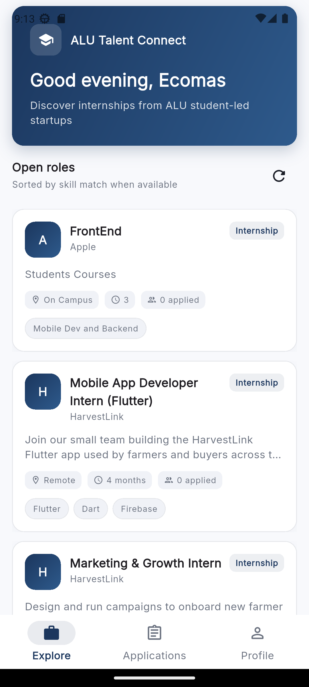

**Figure 2 — Opportunity Detail Screen.** Full posting detail with type/location/duration/application-count metadata and a role-conditional bottom bar (here showing the founder-facing "Only students can apply" state).

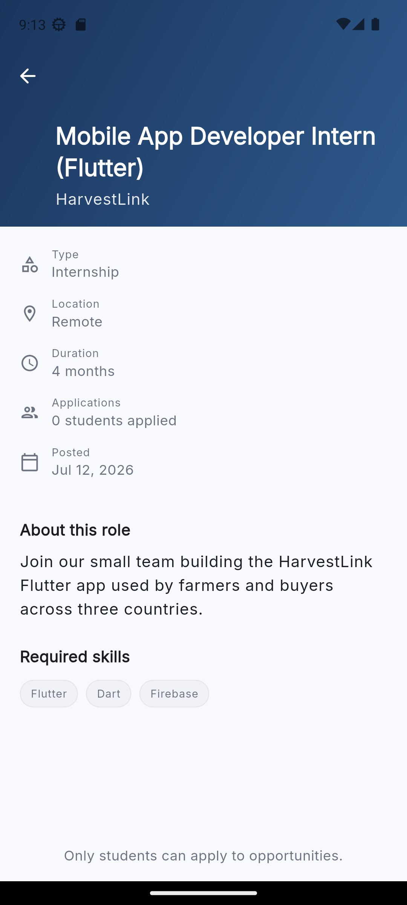

**Figure 3 — Profile Tab (Startup Founder role).** Role badge, linked startup ("Apple"), and founder-only actions ("My opportunities", "Post role").

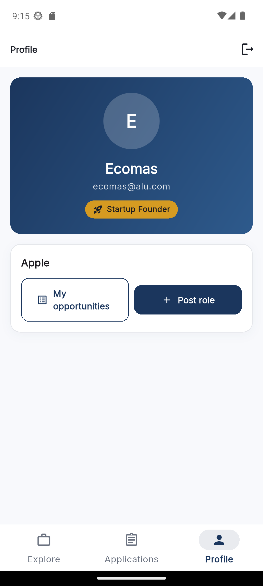

**Figure 4 — My Opportunities Screen.** Founder's own postings with a per-item Active/Inactive toggle (soft delete).

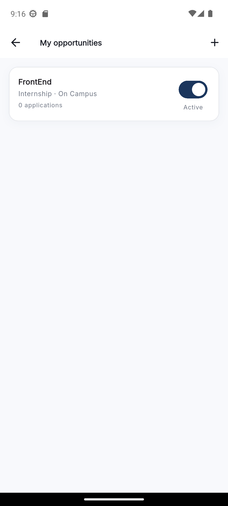

**Figure 5 — Post an Opportunity Form.** Title, description, type/location dropdowns, duration, and required-skills input.

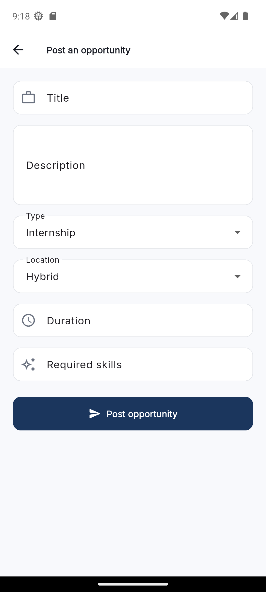

*Additional workflow screens (Login, Register with role picker, student Apply flow, and the founder's Applications-Received review actions) were exercised manually during testing but are not pictured here; they follow the same UI conventions documented in §6.*
